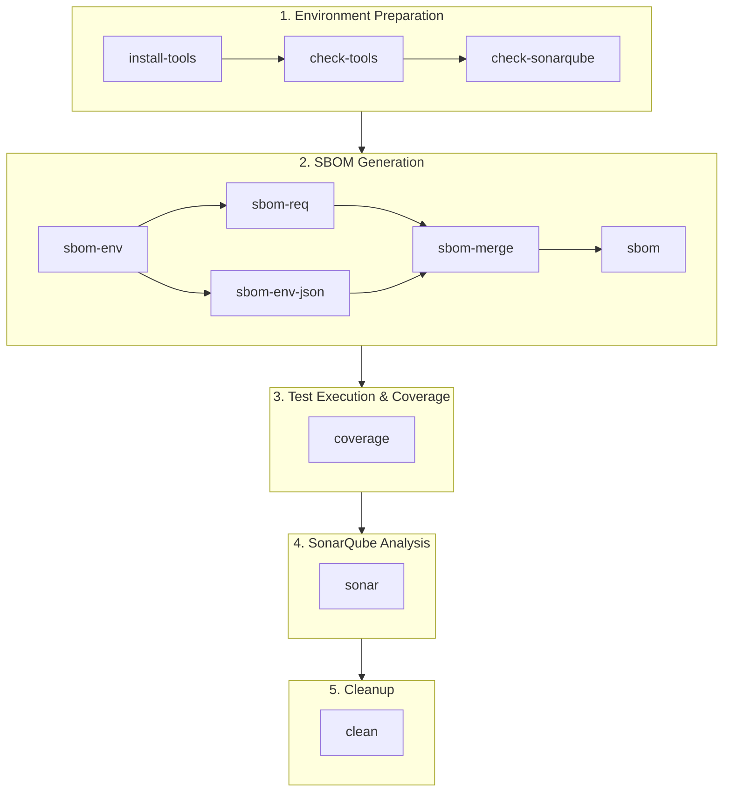

# Makefile Documentation
This Makefile automates the preparation of artifacts needed for evaltech reporting and SonarQube analysis.
It handles the following tasks:

Checking for required tools (pip, pytest, coverage, cyclonedx-py, sonar-scanner)
Creating a dedicated virtual environment for SBOM generation with only runtime dependencies
Generating a CycloneDX SBOM (Software Bill of Materials) in JSON and XML formats
Running unit tests and producing a coverage report (for SonarQube)
Executing the SonarQube scanner to analyze the project
Prerequisites
Before running the Makefile, make sure you have the following installed:

Python 3.9+ (with venv module available)
pip (comes with Python)
Required Python tools (installed via make install-tools):
pytest, pytest-cov
coverage
cyclonedx-bom (provides the cyclonedx-py CLI)
SonarQube Scanner (must be installed manually):
On macOS/Linux typically at /usr/local/sonarscanner/bin/sonar-scanner
Requires a valid configuration in sonar-project.properties
SonarQube Server running and accessible (configured in sonar-scanner.properties or sonar-project.properties)

This Makefile automates setup, SBOM generation, test coverage, and SonarQube analysis for the project.  
It ensures reproducible builds and consistent reporting across environments.  

---

## 📦 Requirements

- Python (with `pip`)
- Installed SonarQube Scanner (`sonar-scanner`)
- Internet access for installing dependencies

For Python tooling, you can run:

```bash
make install-tools
```

This installs:
- `pytest`, `pytest-cov`
- `coverage`
- `cyclonedx-bom`

---

## ⚙️ Targets

### Setup & Tooling

| Target            | Description                                                                 |
|-------------------|-----------------------------------------------------------------------------|
| **check-tools**   | Verifies required tools are installed (`pip`, `pytest`, `coverage`, `cyclonedx-py`, `sonar-scanner`). |
| **check-sonarqube** | Ensures `sonar-project.properties` file exists.                           |
| **install-tools** | Installs Python tools for testing, coverage, and SBOM generation.           |

---

### SBOM (Software Bill of Materials)

| Target           | Description                                                                 |
|------------------|-----------------------------------------------------------------------------|
| **sbom-env**     | Creates a clean virtualenv (`.sbomenv`) with dependencies installed.        |
| **sbom-req**     | Generates SBOM from `requirements.txt` or `requirements.lock`.<br>Provides **good license info**, but no dependency graph. |
| **sbom-env-json**| Generates SBOM from the clean virtualenv.<br>Provides **dependency graph**, but limited license info. |
| **sbom-merge**   | Merges both SBOMs (licenses + dependency graph) and adds root component.    |
| **sbom**         | Shortcut for `sbom-merge`. Produces final SBOM in `build/sbom`.             |

---

### Tests & Coverage

| Target         | Description                                                                  |
|----------------|------------------------------------------------------------------------------|
| **coverage**   | Runs `pytest` with coverage and generates XML report in `build/coverage`.    |

---

### SonarQube Analysis

| Target       | Description                                                                  |
|--------------|------------------------------------------------------------------------------|
| **sonar**    | Runs SonarQube scanner with project settings and uploads results.             |

---

### Cleanup

| Target       | Description                                                                  |
|--------------|------------------------------------------------------------------------------|
| **clean**    | Removes SBOM artifacts, coverage reports, lockfiles, and temporary virtualenv. |

---

## 🚀 Typical Workflows

### 1. First setup on a new machine
```bash
make install-tools check-tools
```

### 2. Generate SBOM
```bash
make sbom
```

### 3. Run tests with coverage
```bash
make coverage
```

### 4. Upload results to SonarQube
```bash
make sonar
```

### 5. Cleanup everything
```bash
make clean
```

---

# Workflow Description

This document explains the detailed workflow for using the Makefile to prepare the project, generate SBOMs, run tests, and perform SonarQube analysis.

---

## 🔄 Overall Process

The workflow consists of **five main phases**:

1. **Environment Preparation**
2. **SBOM Generation**
3. **Test Execution & Coverage**
4. **SonarQube Analysis**
5. **Cleanup**

Each phase is described below.

---

## 1. Environment Preparation

Before running any tasks, make sure the required tools are installed.

```bash
make install-tools
make check-tools
```

- `install-tools` installs Python dependencies (`pytest`, `coverage`, `cyclonedx-bom`).  
- `check-tools` verifies that all required tools are available (`pip`, `pytest`, `coverage`, `cyclonedx-py`, `sonar-scanner`).  
- `check-sonarqube` ensures the `sonar-project.properties` file exists for later analysis.  

---

## 2. SBOM Generation

The SBOM (Software Bill of Materials) is generated in three steps:

1. **Lockfile creation**  
   Creates `requirements.lock` with exact package versions.  
   ```bash
   make sbom-env
   ```

2. **Generate SBOMs**  
   - `sbom-req`: Based on `requirements.txt` / `requirements.lock` (good license info, no dependency graph).  
   - `sbom-env-json`: Based on a clean virtualenv (dependency graph, limited license info).  

   Example:
   ```bash
   make sbom-req
   make sbom-env-json
   ```

3. **Merge SBOMs**  
   Combines both approaches for best results:  
   - Rich license information  
   - Complete dependency graph  
   - Root component added  

   ```bash
   make sbom
   ```

Result:  
Final SBOM is located in `build/sbom/sbom_merged.json`.

---

## 3. Test Execution & Coverage

Run all Python tests with coverage report for SonarQube:

```bash
make coverage
```

- Executes `pytest` with coverage.  
- Produces XML coverage report at `build/coverage/coverage.xml`.  

This file is later imported by SonarQube.

---

## 4. SonarQube Analysis

Run the SonarQube scanner to upload results:

```bash
make sonar
```

- Uses `sonar-project.properties` for configuration.  
- Uploads SBOM, test results, and coverage data to SonarQube at the configured server (`http://sonar.evaltech.de:900`).  
- Results are available in the SonarQube Web UI.  

---

## 5. Cleanup

Remove all generated artifacts to start fresh:

```bash
make clean
```

This deletes:  
- `build/sbom` (SBOM files)  
- `build/coverage` (coverage reports)  
- `.sbomenv` (temporary virtualenv)  
- `requirements.lock` and temporary `requirements.txt`  

---

## 📊 Workflow Diagram



---

## 🚀 Typical End-to-End Workflow

1. Install required tools  
   ```bash
   make install-tools check-tools
   ```
2. Generate complete SBOM  
   ```bash
   make sbom
   ```
3. Run tests and produce coverage  
   ```bash
   make coverage
   ```
4. Upload results to SonarQube  
   ```bash
   make sonar
   ```
5. Clean up temporary files  
   ```bash
   make clean
   ```

---
